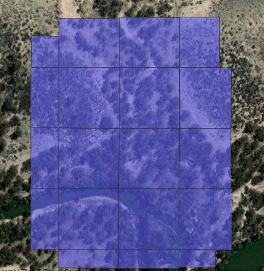
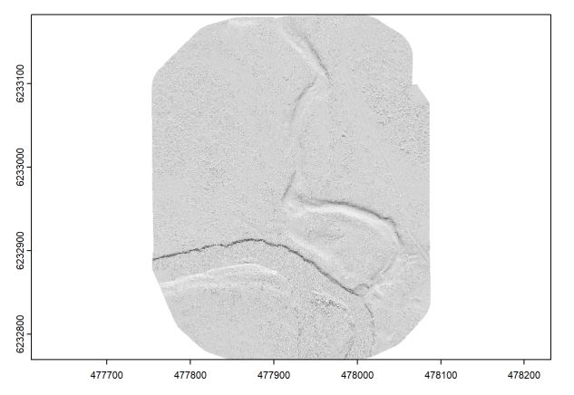
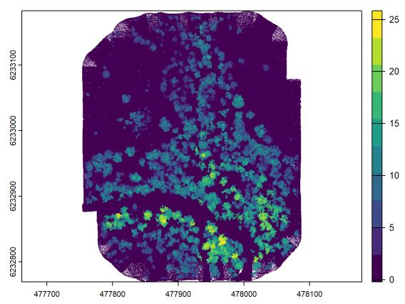
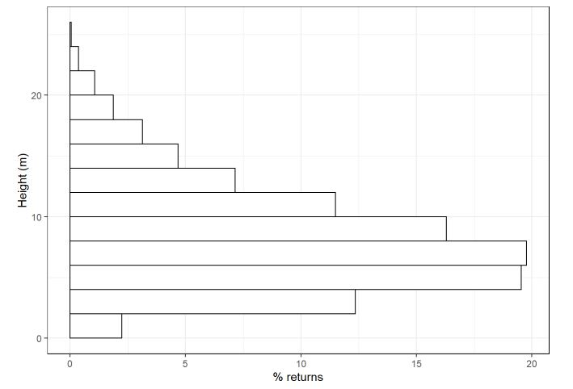
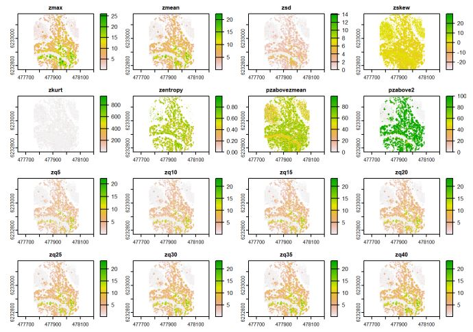

## drone_lidar
Current version of lidR based workflow used with lidar data from DJI Zenmuse L1 sensor. For information on data collection settings and processing please refer to the [Drone Data Collection and Lidar Processing Protocols](https://www.tern.org.au/field-survey-apps-and-protocols/). 
 
-   Ground classification using Cloth Simualtion Filter (CSF) 
-   Generate Digital Terrain Model
-   Normalise heights using ground points
-   Generate Canopy Height Model 
-   Canopy Cover, Canopy Density
-   Exploratory plots
-   Standard metrics

Please note that some of the parameters (search for 'HARDCODED'. e.g., catalog chunk size, raster resolution, algorithm settings) must be updated depending on study site.

Examples from the workflow: 
LAS catalog chunks

Digital Terrain Model

Canopy Height Model

Vertical Profile

LidR Standard Metrics

**Funding**: This project was funded by TERN Landscapes  
**Authors**: Poornima Sivanandam, Darren Turner, Arko Lucieer, School of Geography, Planning and Spatial Sciences, University of Tasmania  
**Acknowledgements**: TERN Landscapes, TERN Surveillance, TERN Data Services
